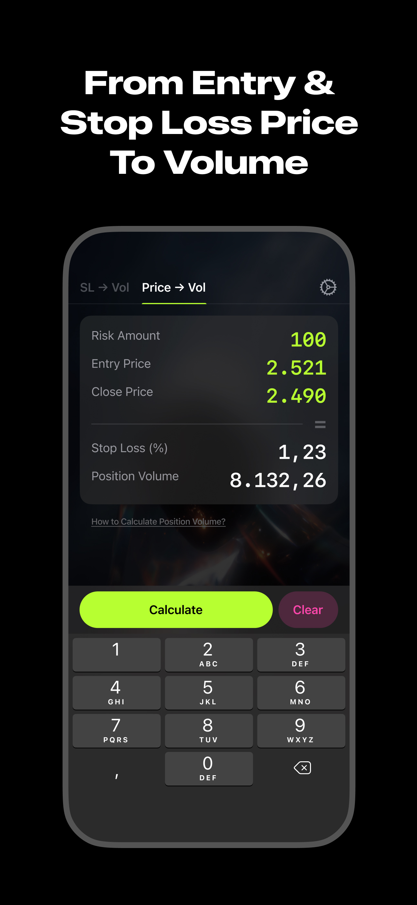

# VolSavvy

  
  
  

VolSavvy is a simple and efficient tool designed for traders who want to quickly calculate trading volume based on their risk management strategy. Whether you’re a beginner or an experienced trader, this app helps you avoid the hassle of manual calculations.

KEY FEATURES:
- % Stop Loss to Volume: Instantly calculate your trade volume using your predefined 1R risk and stop loss percentage.
- Price-Based Calculation: Enter your Entry and Stop Loss price to auto-calculate the trading volume based on your 1R setting.
- Quick Exchange Access: Shortcut buttons to popular exchanges like Binance, BingX, OKX, and MEXC so you can enter your trades right after calculation.
- Offline Support: No internet connection required – works entirely offline.
- Made for Traders Who Prefer Speed Over Spreadsheets: Designed for those who want fast, accurate results without retyping formulas every time.

Ideal for scalpers, day traders, and anyone who values time and precision in trading.

You can review our privacy policy and terms of use here:
- [Privacy Policy](./privacy-policy.md)
- [Terms of use](./terms.md)

For questions or problems, please contact us by email: kenlaam.dev@gmail.com